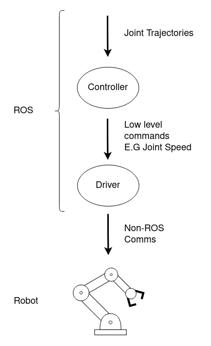
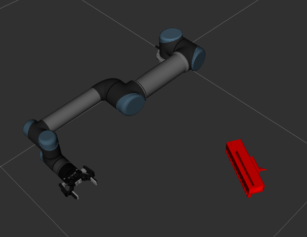
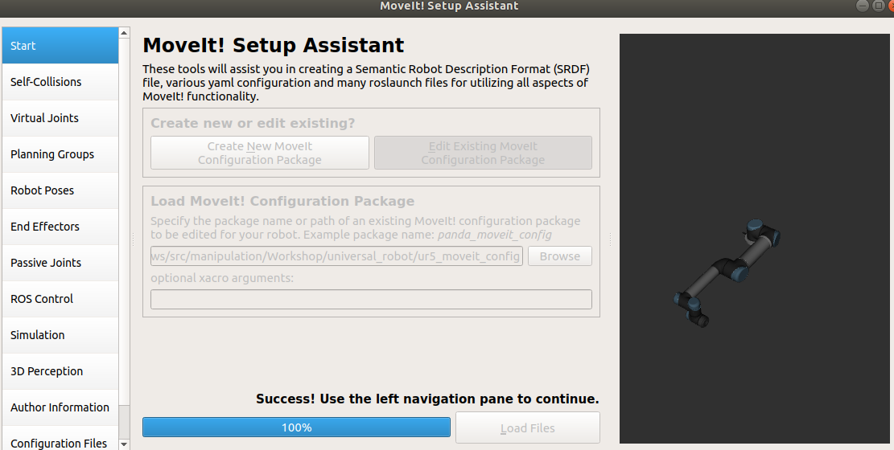

# Manipulation

Through this session, we will be familiarising ourselves with one of the major facets of robotics, *manipulation*.
We will be controlling a Gazebo simulation of a robotic arm, called a Manipulator, using a variety of tools and methods to perform simple tasks in this workshop.


## Background 

We refer to manipulation when we are talking about a robot physically interacting with its surroundings and modifying its environement.
We will be looking at two of the main areas under the manipulation umbrella during this workshop; Path Planning and Grasping.

+ **Path Planning:**
Generally, a robotic arm is used for manipulation ([ABB IRB 120](https://new.abb.com/products/robotics/industrial-robots/irb-120), [UR5](https://www.universal-robots.com/products/ur5-robot/)).
An arm often has between 5 and 7 Dof.
Powerful planning algorithms must be used ([RRTs](https://en.wikipedia.org/wiki/Rapidly-exploring_random_tree) for example) to find a path in joint or end-effector space.
+ **Grasping:**
Once the arm knows how to travel from one place to another, its time to actually grasp something.
Grasping in a vast and vibrant research topic mostly because how challenigng it can be for robots to find suitable grasp poses for everyday objects.


## Preperation

There are a number of old ROS packages included in this repo by source.
These packages have been copied in and adapted as they do not exist for noetic, and the dependancies they would originally specify are not all available too.

```sh
cd <workspace root>
rosdep install --from-paths src --ignore-src -r -y
```


## Our Simulated Manipulator

We will be using a simulation of a UR5 by Universal Robots for this workshop session.
The arm will have a Robotiq 2F85 (Which stands for 2 Finger 85mm Span) gripper, or an End Effector [EEF], and a Microsoft Kinect V2 RGBD camera attached.
Similar to the previous sessions, we will simulate our robot using Gazebo.

The package `ur_gazebo` in the `universal_robots` directory contains a simulation launch file for us already.
Explore the package, and any others you want to see before we dive in, and find a launch file which you believe is the correct entry point/top level launch file.

<details><summary>Click for a hint</summary>

```
roslaunch ur_gazebo ur5_launch
```

</details>
<br>

You should see something like this:


## Controllers

Every motor for every joint on the robots we control needs a driver to translate our ROS commands into commands specific to the robot we are dealing with.
Above this, ROS control offers "controllers" which oversee a commanded trajectory and supply the drivers with low level, high frequency commands to ensure that the path taken is correct.



This is not the only way to control robot.
There are many ways in which the driver for the robotic manipulator may be interfaced with, all depending on the design of the driver.
The simulation we are running has the controllers loaded and operated by Gazebo itself, using the `gazebo_ros_control` package which is downloaded with the full desktop version of ROS.
The joint trajectories are published to Gazebo which emulates the effect of the controller.

Regardless, lets go explore what controllers are running in our simulation, and where they are defined/configured.


### Defining the Controllers

I recommend to install an rqt widget called `rqt_controller_manager`.
Run this and lets see what got loaded when we launched our simulation.
You should see something like this when you select the controller namespace in the drop down box at the top.


Double click on these individual entries and observe the joints that they have claimed, and what type of controller it is.

You can alternatively call a particular rosservice call to the controller manager.
The controller manager is the node which coordinates controllers and makes sure they do not clash during run time.
Are you able to find the service to call and obtain the list without guidance?

<details><summary>Click for a walkthrough</summary>

```
# List the services available
rosservice list

# List the controllers
rosservice call /controller_manager/list_controllers
```

</details>
<br>

So, where does these come from?
Spend some time now searching through the `universal_robot` directory under `Workshop`.
Can you find the config file where the controllers are defined, and when the are loaded?

<details><summary>Click to see the files</summary>

The configuration for the arm and gripper controllers are loaded in the very launch file we started the simulation off with.
Lines 25 and 26 are below.

```xml
<rosparam file="$(find ur_gazebo)/controller/arm_controller_ur5.yaml" command="load"/>
<node name="arm_controller_spawner" pkg="controller_manager" type="controller_manager" args="spawn arm_controller gripper_controller" respawn="false" output="screen"/>
```

Line 25 shows you where you can find the controller config file.
Line 26 shows us how this configuration file is used to load the controllers we want, and have them take control of the joints we want them to.
But, what about the `joint_state_controller`?
This is contained in another launch file, referenced on line 22 of the `ur_gazebo ur5.launch` file we have been looking at.

```xml
<include file="$(find ur_gazebo)/launch/controller_utils.launch"/>
```

</details>
<br>


### Putting the controllers to use

I recommend installing a simple rqt widget called `rqt_joint_trajectory_controller`.


This widget allows one to set individual joint values on the fly, and the commands are all turned into joint trajectories and sent to the controllers.
Run `rqt_graph` after hitting the red power button (it will turn green if successful) to see how this widget operates in the ROS stack.
Also, echo the commands Gazebo is recieving from this widget.


## Rviz

You should have been seeing the simulated robot move in Gazebo up until now.
Let's have a look at it in Rviz, as if we were visualizing our real robot.
We will see how to control the robot with Rviz, like you have done in your previous session, later in this workshop.

Open up a fresh Rviz window and we will incrementally add to it as we go.

### Robot Model

Let's check that we are recieving feedback from the robot through the `/joint_states` topic before we get to the Rviz window.

You should see something like:

```
header: 
  seq: 206558
  stamp: 
    secs: 3364
    nsecs: 470000000
  frame_id: ''
name: [abb2_joint_1, abb2_joint_2, abb2_joint_3, abb2_joint_4, abb2_joint_5, abb2_joint_6,
  finger_1_dist_joint, finger_1_med_joint, finger_1_prox_joint, finger_2_dist_joint,
  finger_2_med_joint, finger_2_prox_joint, finger_3_dist_joint, finger_3_med_joint,
  front_left_wheel, front_right_wheel, rear_left_wheel, rear_right_wheel]
position: [0.00032209507270231086, 0.029705080560157526, -0.045566170951020446, 0.0013755875530101491, 0.011665304611981675, 0.0042873037305675155, 0.6000000000889099, 9.921607535545718e-09, -1.3813679089480502e-09, 0.6000000000623906, 9.533138722872536e-09, 4.088242899769057e-08, 0.5999999999707182, 8.249177341212999e-08, -3.791679371458411, -3.7625546328459993, -3.82143007050297, -3.825014721779551]
velocity: [0.0031072944551323338, -0.00024589280552260895, -0.0003502345108150297, -0.01642694515454311, 0.0002473546599235343, 0.015647407170457883, 8.890796740994584e-09, 1.4727589797510176e-08, -5.6046476257774576e-08, 6.238657163250017e-09, 1.0317774130493553e-08, -1.666632588062669e-07, -2.9254809393228006e-09, -1.212269241301142e-07, 9.066189840782844e-05, 0.00020114626581779229, 8.929489784498638e-05, 0.0001963030063448588]
effort: [0.0, 0.0, 0.0, 0.0, 0.0, 0.0, 0.0, 0.0, 0.0, 0.0, 0.0, 0.0, 0.0, 0.0, 0.0, 0.0, 0.0, 0.0]
```

You should have some experience with the Rviz window from the previous sessions in this workshop.
Add a new display with the "add" button, and search for `RobotModel`.
Make sure the global options for the fixed frame is set to something that exists, such as `base_link`, and you should see something like below.



If it wasn't made clear in the previous workshop lessons, Rviz shows the robot model here using the Transform Tree [tf tree].
We launched a node called the `robot_state_publisher` which converts the joint states we echoed above into transformations, depicting where the robot limbs are relative to eachother.
Go ahead and launch the ros graph rqt widget and see what I mean!

<details><summary>See what I mean!</summary>


</details>
<br>

## MoveIt

[Moveit](https://moveit.ros.org/) is a very powerful tool within the ROS ecosystem for planning manipulation motions.
We will be lightly touching on how to use MoveIt, but there is a plethora of configuration options you will learn about in due time.

There is a package in the `universal_robot` directory which has "moveit" in its name.
Search through it and see if any lauch stands out to you.

<details><summary>Click for the answer</summary>
 
```
 roslaunch ur5_moveit_config ur5_moveit_planning_execution.launch                                                    
```

</details>
<br>

MoveIt comes with an Rviz plugin for planning and executing motions.
This is all included in the full desktop version of ROS, so you don't need to worry about installing anything new right now.
In Rviz, load the `MotionPlanning` plugin.


In the *planning* tab of the motion planning pluggin, you will need to set the `Planning Group`, the `Start State`, and the `Goal State`.
* The `Planning Group` is a predefined list of actuated joints in a configuration file which we will view later.
  * This list of joints can stretch over multiple controllers and `Planning Groups`, but it becomes difficult to ensure that all joints are currently handled by controllers.
* The `Start State` is typically only important when using MoveIt programmatically, since you can create plans in advance if you know within a tolerance where the arm will be when you go to execute the plan.
  * It is usually best to leave it in `<current>` else you will start recieving errors when you try to move the arm from a position that is not the start state defined in the trajectory created.
* You will see in the drop down for the `Start State` and the `Goal State` that there are named position options.
  * These are defined in a configuration file in which you can give specific joint configurations names for repeated execution.

When you are ready and have given the goal a state other than `<current>`, hit `Plan & Execute` and lets see what happens.

<details><summary>Click for a Spoiler</summary>

IT'S NOT GOING TO MOVE
  
Have a look at the terminal where you've launched moveit from.
You should see an error.... that's right, two links are in collision, in fact, all links are in collision!
Something is wrong in our moveit configuration  

</details>

### Moveit setup assisstant

MoveIt has a very large number of configuration files and factors to consider.
Luckily, MoveIt has a setup assistant which gives us a GUI to create and edit these moveit configuration packages.
The launch file we used before came from a package made with the setup assisstant.

We will use this tool to fix our borked package.

<details><summary>Install in the usual fashion</summary>

```sudo apt install ros-noetic-moveit-setup-assistant``` 

</details>
<br>

**<span style="color:red">Known Issue</span>**

There seem to be a bug in `moveit_setup_assistant` latest release which causes to crash when loading a config for editing. Try the next few steps and if it crashes, skip to <s>moveit_setup_assistant</s> .

**ACTION**
Install moveit-setup-assistant

Ultimately, the setup assistant will help us create a package containing all the moveit configuration files along with launch files to get the robot up and running. 

**ACTION**
Launch the moveit-setup assistant and load the broken moveit configuration file.


<details><summary>Click for Hint</summary>
  
<p>
  
`roslaunch moveit_setup_assistant setup_assistant.launch`

</p> 

</details>
<br>

Once loaded you should see a model of your robot appear on the right:



Now take a look at the *Self-Collision* tab (our issue had to do with link collisions). You will notice that there are no collisions defined. Go ahead a generate a collision matrix. 

**NOTE: The gripper is not visible in the robot model**

**ACTION**
Generate a collision matrix.

Two other important tabs in the setup assistant are *Planning Groups* and *End Effectors*. The first one is where we define the joints and links the hand and arm will use for planning. The name are the group are important to know. 

**ACTION**
Inspect how the arm group is formed in the setup assistant.

The *End Effectors* tab is where we define the end-effector of our robot. It won't be used this time.

If you want to understand the Moveit setup assistant better, go through this [tutorial](https://ros-planning.github.io/moveit_tutorials/doc/setup_assistant/setup_assistant_tutorial.html) in your own time.

You can now go to the bottom most tab *Configuration Files*. This is where we generate the moveit pkg and all relevant files. By generating the collision matrix, you would have modified the *.srdf*  file. Before generating the package make sure you select the *.srdf* so that it gets regenerated. All the other boxes can be left as they are.


**ACTION**

Select `config/ur5.srdf` and click Generate Package.


## <s>moveit_setup_assistant</s>

If the `moveit_setup_assistant` crashes, you can still modify the relevant files manually to generate to enable the collision matrix. Look for a semantic robot description file.

<details><summary>Click for Hint</summary>
  
<p>
semantic robot description file or `srdf`, are located within the moveit_config file. 

</p> 

<details><summary>Click to cheat!</summary>
  
`roscd ur5_moveit_config/config/`

uncomment the disabled collisions.

</details>

</details>
<br>

### Kinect

**ACTION** Check that you are getting images and point clouds from the simulated Kinect sensor

<details><summary>Click for Hint</summary>

View this image topic: `/kinect2/rgb/image_raw`

View this Pointcloud topic: `/kinect2/depth_registered/points` (e.g. using `rviz`)

</details>

You can now leave the setup assistant and retry launching `roslaunch ur5_moveit_config ur5_moveit_planning_execution.launch`.

You should now be able to plan a path and see the robot move in Gazebo.
Spend some time to use the `Motion planning` rviz pluggin
## Using Moveit

**A quick example a giving a goal to Moveit in a .cpp file**

```rosrun manipulation moveit_expl```

**ACTION**
Inpect this file, see what it does and how. You will need this knowledge later.


Obviously we want to use our newly acquired super-tool to do more than move an arm around using Rviz. It is time to create a application for our arm. A common one is to grasp an object which position is determined using sensors. Here we will be using an image and apriltags.


**ACTION**
Spawn an apriltag in gazebo and start the detectection.

<details><summary>Click for Hint</summary>
  
<p>
  

`roslaunch apriltags_gazebo apriltag_spawn.launch`
`roslaunch apriltags_gazebo continuous_detection.launch`

  

</p> 

</details>
<br>

Now view this detection image on the topic `/tag_detections_image/compressed`


<details><summary>Click for Hint</summary>
  
<p>
  

`rosrun rqt_image_view rqt_image_view "/tag_detections_image/compressed"`

  

</p> 

</details>
<br>


**Applicaiton = Integration**

To create any application in ROS we need to integrate several modules together. From the [perception](https://github.com/ros-workshop/perception) workshop, we now have the pose of our apriltag.

 + Module 1 : Apriltag detection 
    - output: tf from `camera_link` to `tag_link`
    
What we want is to grasp the object with the tag
 
 + Module 3 : Object grasping
    - output: arm and hand trajectory msgs
    - input: pose of the object (`geometry_msgs/Pose`)
 
 We are not quite there! the output of module 1 does not match the input of module 3. We need module 2.
 
 ### Transform listener
 
 Have a look at the node `transform_tag_location.cpp` located in `manipulation`.
 
 Run this node and see what it does. Modify it so we obtain a `geometry_msgs/Pose` out of it.
 
 **ACTION**
Run `transform_tag_location`node and modify it to get a `geometry_msgs/Pose`.
 
 <details><summary>Click for Hint</summary>

<p>

Don't worry about the orientation.

The transform should be from the `planning frame` to the tag frame . You can find out the planning frame when running `moveit_expl`

`rqt_tf_tree` adn `tf_monitor` might be useful

</p> 

</details>
<br>

You should now have the module 2:

 + Module 2 : msg transform
    - output: pose of the object (`geometry_msgs/Pose`)
    - input: tf from `planning frame` to `tag_link`


### The Manipulation Pipeline

We now have all 3 modules required. Make sure that you have module 1 and 2 running. 

<details><summary>Quick Recap</summary>
  
<p>

To have everything up at running you need to have launched the following:

```
roslaunch ur_gazebo ur5_joint_limited.launch
roslaunch ur5_moveit_config ur5_moveit_planning_execution.launch 
roslaunch apriltags_gazebo apriltag_spawn.launch 
roslaunch apriltags_gazebo continuous_detection.launch  
rosrun manipulation transform_tag_location 
```

</p> 

</details>
<br>

**Note: It is about time to create a launch file**

Now run `object_grasp_server`. You should see the arm move to a home position. In the terminal, you should see `"tag detected"` if all the required nodes are running. 

As it name indicate, `object_grasp_server` is a server waiting for a request. Find out what the name of the service is.

<details><summary>Hint</summary>
  
<p>

Use `rosnode info` or `rosservice list`

</p> 

</details>
<br>

**ACTION**
Call the service from a terminal and observe the robots behaviour. 


**ACTION**
Modify `object_grasp_server.cpp` to make hand grasp the object and that arm drop it on the second stand.

<details><summary>Hint</summary>
  
<p>

Refer to the previous example `moveit_expl.cpp`

/*################Place your code here ##############*/
Indicates where to add code

Some line only need to be commented out

</p> 

</details>
<br>

**Note: We are tricking gazebo to attach the object to the gripper**

**Note: The gripper model is very sensitive and might break down if it hit the environment. In this case, restart the simulation**

## Strech Goals 

**Goal:** make the arm grasp the object while avoiding the environment

Restart the Gazebo simulation , move the arm to home positionm and launch `obsatcle_apriltag_spawn`. Grasp the object without hittting obstacles.


<details><summary>Hint</summary>
  
<p>

Moveit will do the obstacle avoidance for you provided an OctoMap

An OctoMap can be created using a depth camera

Consult the [moveit tutorial](https://ros-planning.github.io/moveit_tutorials/doc/perception_pipeline/perception_pipeline_tutorial.html) 

</p> 

</details>
<br>
